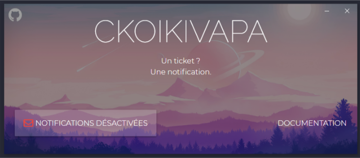
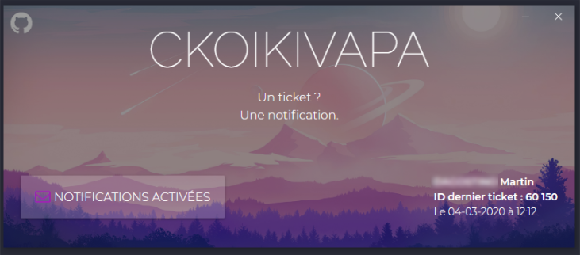

# ALERTES GLPI 🚀

Application permettant l'affichage de notification provenant de l'OS pour chaque nouveau suivi ou ticket GLPI de l'utilisateur connecté.

Fonctionnalités :
-   Notification Windows à chaque nouveau ticket
-   Notification Windows à chaque nouveau suivi de ticket
-   Connexion dans l'application si l'utilisateur n'est pas connecté à GLPI
-   Fonctionne sur un réseau externe si le serveur GLPI est ouvert à l'extérieur
-   Documentation du paramétrage inclu dans l'application


# PRÉSENTATION

## Notifications désactivées



## Notifications activées



## Notifications Windows 10 (7 comptatible)


## Frameworks utilisés
-   Electron https://www.electronjs.org/docs
-   NodeJS 12 https://nodejs.org/fr/download/
-   Electron-builder https://www.electron.build/cli
-   Notifications fonctionelles avec https://github.com/mikaelbr/node-notifier/issues/144#issuecomment-319324058 et https://stackoverflow.com/questions/47810041/electron-with-node-notifier-display-windows-10-notification
-   Sass to CSS https://medium.com/@kanokpit.skuberg/easy-sass-project-and-compile-with-npm-5861457195b5
-   Electron Store https://github.com/sindresorhus/electron-store
-   Windows buttons https://github.com/binaryfunt/electron-seamless-titlebar-tutorial
-   Icône via https://www.flaticon.com/search/7?style_id=1094&order_by=4&grid=small
# INSTALLATION

1.  Installer NodeJS
2.  Installer NPM
3.  Installer yarn si compilation du programme (puis lancer ``yarn add electron-builder --dev``), plus d'informations ici : https://github.com/electron-userland/electron-builder
4.  Instaler Electron via ``npm install electron -g``
5.  Télécharger le repository Git (installer Git si pas installé)
```
git clone https://github.com/Extreeeme/Notifications-GLPI
```
6.  Se placer dans le dossier ``AlertesGLPI``
```
npm install
```
7.  Lancer l'application avec la commande ``electron .`` pour les tests en local  (enlever les ``resources/`` devant chaque ``resources/assets`` dans les fichiers pour pointer vers les bonnes ressources quand l'application sera compilée)
8.  Compiler l'application en un .msi avec Electron-builder
```
yarn dist
```